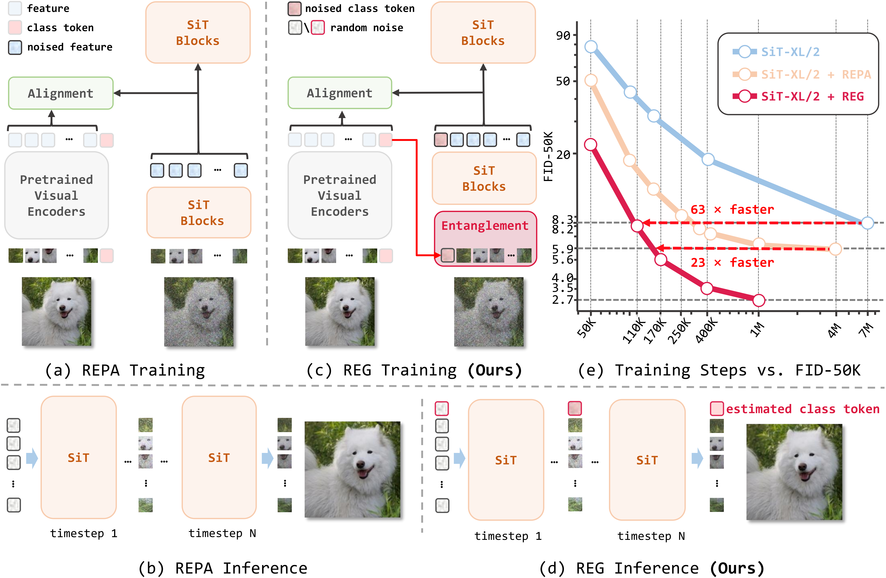

<p align="center">
  <h1 align="center">Representation Entanglement for Generation: Training Diffusion Transformers Is Much Easier Than You Think
</h1>
  <p align="center">
      <a href='https://github.com/Martinser' style='text-decoration: none' >Ge Wu</a><sup>1</sup>&emsp;
      <a href='https://github.com/ShenZhang-Shin' style='text-decoration: none' >Shen Zhang</a><sup>3</sup>&emsp;
      <a href='' style='text-decoration: none' >Ruijing Shi</a><sup>1</sup>&emsp;
      <a href='https://shgao.site/' style='text-decoration: none' >Shanghua Gao</a><sup>4</sup>&emsp;
      <a href='https://zhenyuanchenai.github.io/' style='text-decoration: none' >Zhenyuan Chen</a><sup>1</sup>&emsp;
      <a href='https://mmcheng.net/cmm/' style='text-decoration: none' >Lei Wang</a><sup>1</sup>&emsp;     
      <a href='https://www.zhihu.com/people/chen-zhao-wei-16-2' style='text-decoration: none' >Zhaowei Chen</a><sup>3</sup>&emsp;
      <a href='https://gao-hongcheng.github.io/' style='text-decoration: none' >Hongcheng Gao</a><sup>5</sup>&emsp;
      <a href='https://scholar.google.com/citations?view_op=list_works&hl=zh-CN&hl=zh-CN&user=0xP6bxcAAAAJ' style='text-decoration: none' >Yao Tang</a><sup>3</sup>&emsp;
      <a href='https://scholar.google.com/citations?user=6CIDtZQAAAAJ&hl=en' style='text-decoration: none' >Jian Yang</a><sup>1</sup>&emsp;
      <a href='https://mmcheng.net/cmm/' style='text-decoration: none' >Ming-Ming Cheng</a><sup>1,2</sup>&emsp;
      <a href='https://implus.github.io/' style='text-decoration: none' >Xiang Li</a><sup>1,2*</sup>&emsp;
        <p align="center">
        $^{1}$ VCIP, CS, Nankai University, $^{2}$ NKIARI, Shenzhen Futian, $^{3}$ JIIOV Technology, 
        $^{4}$ Harvard University, $^{5}$ University of Chinese Academy of Sciences 
        <p align='center'>
      <div align="center">
       <a href='https://arxiv.org/abs/2507.01467'></a>
	  </div>
    <p align='center'>
    </p>
   </p>
</p>


## 🚩 Overview 



REPA and its variants effectively mitigate training challenges in diffusion models by incorporating external visual representations from pretrained models, through alignment between the noisy hidden projections of denoising networks and foundational clean image representations. 
We argue that the external alignment, which is absent during the entire denoising inference process, falls short of fully harnessing the potential of discriminative representations. 

In this work, we propose a straightforward method called Representation Entanglement for Generation (REG), which entangles low-level image latents with a single high-level class token from pretrained foundation models for denoising. 
REG acquires the capability to produce coherent image-class pairs directly from pure noise, substantially improving both generation quality and training efficiency. This is accomplished with negligible additional inference overhead, requiring only one single additional token for denoising (<0.5\% increase in FLOPs and latency).
The inference process concurrently reconstructs both image latents and their corresponding global semantics, where the acquired semantic knowledge actively guides and enhances the image generation process.

On ImageNet $256{\times}256$, SiT-XL/2 + REG demonstrates remarkable convergence acceleration, achieving $\textbf{63}\times$ and $\textbf{23}\times$ faster training than SiT-XL/2 and SiT-XL/2 + REPA, respectively. 
More impressively, SiT-L/2 + REG trained for merely 400K iterations outperforms SiT-XL/2 + REPA trained for 4M iterations ($\textbf{10}\times$ longer).

## 📋 Plan
- More training steps on ImageNet 256&512 and T2I.


## 👊 Usage

### 1. Environment setup

```bash
conda create -n reg python=3.10.16 -y
conda activate reg
pip install torch==2.1.1 torchvision==0.16.1 torchaudio==2.1.1
pip install -r requirements.txt
```

### 2. Dataset

#### Dataset download

Currently, we provide experiments for ImageNet. You can place the data that you want and can specifiy it via `--data-dir` arguments in training scripts.

#### Preprocessing data
Please refer to preprocessing guide.

### 3. Training
Run train.sh
```bash
bash train.sh
```

train.sh contains the following content.
```bash
accelerate launch --multi_gpu --num_processes $NUM_GPUS train.py \
    --report-to="wandb" \
    --allow-tf32 \
    --mixed-precision="fp16" \
    --seed=0 \
    --path-type="linear" \
    --prediction="v" \
    --weighting="uniform" \
    --model="SiT-B/2" \
    --enc-type="dinov2-vit-b" \
    --proj-coeff=0.5 \
    --encoder-depth=4 \     #SiT-L/XL use 8, SiT-B use 4
    --output-dir="your_path" \
    --exp-name="linear-dinov2-b-enc4" \
    --batch-size=256 \
    --data-dir="data_path/imagenet_vae" \
    --cls=0.03
```

Then this script will automatically create the folder in `exps` to save logs and checkpoints. You can adjust the following options:

- `--models`: `[SiT-B/2, SiT-L/2, SiT-XL/2]`
- `--enc-type`: `[dinov2-vit-b, clip-vit-L]`
- `--proj-coeff`: Any values larger than 0
- `--encoder-depth`: Any values between 1 to the depth of the model
- `--output-dir`: Any directory that you want to save checkpoints and logs
- `--exp-name`: Any string name (the folder will be created under `output-dir`)
- `--cls`: Weight coefficients of REG loss


### 4. Generate images and evaluation
You can generate images and get the final results through the following script. 
The weight of REG can be find in this [link](https://pan.baidu.com/s/1QX2p3ybh1KfNU7wsp5McWw?pwd=khpp).

```bash
bash eval.sh
```


## Citation
If you find our work, this repository, or pretrained models useful, please consider giving a star and citation.
```
@article{wu2025reg,
  title={Representation Entanglement for Generation: Training Diffusion Transformers Is Much Easier Than You Think},
  author={Ge Wu and Shen Zhang and Ruijing Shi and Shanghua Gao and Zhenyuan Chen and Lei Wang and Zhaowei Chen and Hongcheng Gao and Yao Tang and Ming-Ming Cheng and Xiang Li},
  journal={arXiv preprint arXiv:2507.01467},
  year={2025}
}
```

## Contact
If you have any questions, please create an issue on this repository or contact at gewu.nku@gmail.com.


## Acknowledgements

Our code is based on [REPA](https://github.com/muzairkhattak/PromptSRC), along with [SiT](https://github.com/willisma/SiT), [DINOv2](https://github.com/facebookresearch/dinov2), [ADM](https://github.com/openai/guided-diffusion) and [U-ViT](https://github.com/baofff/U-ViT) repositories. We thank the authors for releasing their code. If you use our model and code, please consider citing these works as well.


